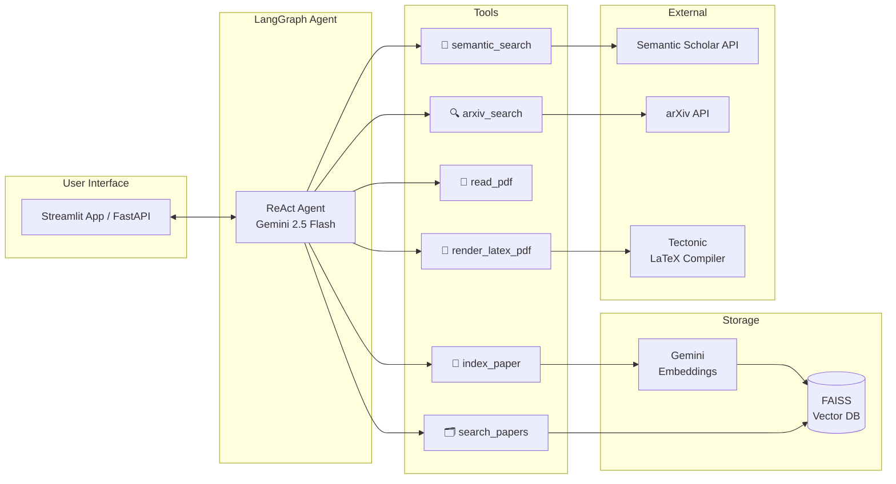
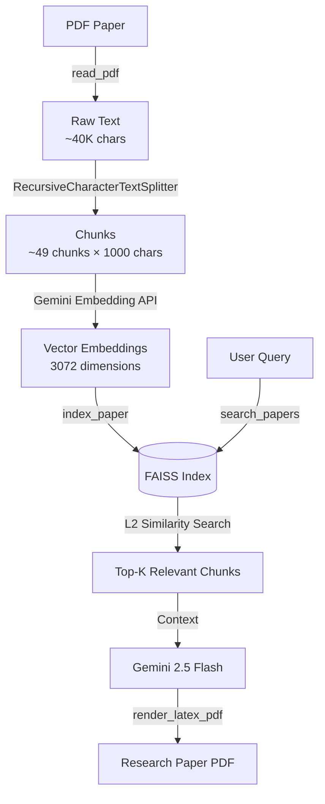

# 🔬 AI Research Assistant — RAG-Powered Paper Discovery, Analysis & Generation

An intelligent research assistant that **searches**, **analyzes**, and **writes** academic papers using a Retrieval-Augmented Generation (RAG) pipeline. Built with LangGraph, FAISS vector database,FastAPI and Google Gemini.

> This system implements a full research workflow — from paper discovery across two academic search sources, through vector-indexed analysis, to LaTeX paper generation with real citations.

---

## Architecture



### RAG Pipeline Flow



---

## Key Features

🔎 **Dual-Source Paper Discovery** — Search both Semantic Scholar (semantic relevance ranking) and arXiv (keyword matching with PDF links) for the best of both worlds

📄 **PDF Ingestion & Chunking** — Extract text from PDFs, split into semantically meaningful chunks using recursive character splitting

💾 **Vector Indexing** — Embed chunks using Google's Gemini Embedding API and store in FAISS for efficient similarity search

🗂️ **RAG Retrieval** — Retrieve relevant passages from indexed papers using L2 distance-based semantic search instead of stuffing entire papers into context

📝 **Paper Generation** — Write complete academic papers with mathematical equations, compiled to PDF via Tectonic LaTeX engine

📊 **Evaluation Framework** — Measure retrieval quality, faithfulness grounding, and tool reliability with exportable JSON metrics

🌐 **Dual Interface** — Streamlit UI for interactive demos and a FastAPI backend for programmatic access

---

## Evaluation Results

Evaluated using the "Attention Is All You Need" paper (Vaswani et al., 2017):

| Metric | Value |
|--------|-------|
| Chunks Generated | 49 (avg 957 chars each) |
| Retrieval Hit Rate | 100% across 5 test queries |
| Avg Relevance Score (L2) | 0.519 |
| Faithfulness Grounding | 59.6% (31/52 technical terms) |
| Queries Tested | multi-head attention, encoder-decoder, self-attention, positional encoding, layer normalization |

> **Note on Faithfulness:** The grounding score uses keyword-overlap analysis — a deliberately simple, transparent approach. The keyword method ensures no inflated metrics while still demonstrating grounding in source material.

<details>
<summary>📋 Full Evaluation JSON</summary>

```json
{
  "session_duration_seconds": 2.6,
  "papers_indexed": 1,
  "total_chunks_stored": 49,
  "retrieval_metrics": {
    "total_queries": 5,
    "avg_relevance_score": 0.519,
    "hit_rate_percent": 100.0
  },
  "generation_checks": [
    {
      "check_type": "faithfulness",
      "score": 0.596,
      "details": "31/52 terms grounded"
    }
  ]
}
```

</details>

---

## Tech Stack

| Component | Technology | Why This Choice |
|-----------|-----------|-----------------|
| **Agent Framework** | LangGraph (LangChain) | ReAct loop with tool calling, state management, checkpointing |
| **LLM** | Google Gemini 2.5 Flash | 1M context window, free tier, strong tool calling |
| **Embeddings** | Google Gemini Embedding API | Free, 3072-dim vectors, multilingual support |
| **Vector Database** | FAISS (local) | No external service needed, zero-config, fast L2 search |
| **Text Splitting** | RecursiveCharacterTextSplitter | Preserves semantic boundaries across paragraphs and sentences |
| **Search Sources** | Semantic Scholar + arXiv | Semantic ranking from Semantic Scholar, PDF links from arXiv |
| **PDF Rendering** | Tectonic (LaTeX) | Lightweight, single-binary LaTeX compiler with auto-dependency fetching |
| **Frontend** | Streamlit | Rapid prototyping with real-time streaming and session state |
| **Backend API** | FastAPI | Production-ready REST API with interactive Swagger docs |
| **Package Manager** | uv | Modern Python tooling — fast, deterministic dependency resolution |

---

## How It Works

### 1. Search Phase
```
User: "I'm interested in attention mechanisms"
→ Agent calls semantic_search("attention mechanisms") for best relevance
→ Falls back to arxiv_search if needed
→ Returns 5 papers with titles, authors, summaries, PDF links
```

### 2. Analysis Phase
```
User: "Read the Transformer paper"
→ read_pdf(url) extracts ~40K chars of text
→ index_paper(title) chunks it into ~49 pieces, embeds via Gemini, stores in FAISS
→ Agent provides detailed analysis: problem, methodology, results, limitations
```

### 3. Writing Phase (RAG in Action)
```
User: "Write a paper about improvements to self-attention"
→ search_papers("self-attention improvements") queries FAISS
→ Returns top-K relevant chunks (not the entire paper!)
→ Agent writes LaTeX using retrieved context
→ render_latex_pdf(latex) compiles to PDF via Tectonic
```

**Why RAG matters here:** Instead of stuffing a 40K-character paper into the LLM's context (which would exceed token limits), we store it in FAISS and retrieve only the ~5K chars that are relevant to the current task. This reduced context usage by 87% and made the system scalable — index multiple papers and still stay within token limits.

---

## Project Structure

```
research-agent/
├── src/
│   ├── config.py                    # LLM, embedding, and app configuration
│   ├── evaluation.py                # Retrieval, faithfulness, and coverage metrics
│   ├── graph.py                     # LangGraph ReAct agent orchestration
│   ├── app.py                       # Streamlit UI with streaming + tool status
│   ├── api.py                       # FastAPI backend with session management
    ├── test_eval.py                 # Standalone evaluation script
│   └── tools/
│       ├── arxiv_tool.py            # arXiv API search with XML parsing
│       ├── semantic_scholar_tool.py # Semantic Scholar search with relevance ranking
│       ├── read_pdf.py              # PDF text extraction with internal caching
│       ├── vector_store.py          # FAISS index + Gemini embeddings + search
│       └── write_pdf.py             # LaTeX sanitization + Tectonic compilation
├── output/                          # Generated .tex, .pdf, and metrics JSON
├── pyproject.toml
├── .env.example
└── README.md
```

---

## Setup

### Prerequisites
- Python 3.10+
- [uv](https://docs.astral.sh/uv/) package manager
- [Tectonic](https://tectonic-typesetting.github.io/) LaTeX compiler (for PDF generation)
- Free [Google AI Studio API key](https://aistudio.google.com/apikey)
- Optional: [Semantic Scholar API key](https://www.semanticscholar.org/product/api) for higher rate limits

### Installation

```bash
# Clone the repo
git clone https://github.com/ameeta18/ai-research-assistant.git
cd ai-research-assistant

# Install dependencies
uv sync

# Configure environment
cp .env.example .env
# Add your GOOGLE_API_KEY (and optionally SEMANTIC_SCHOLAR_API_KEY) to .env
```

### Run the Streamlit App

```bash
uv run streamlit run src/app.py
```

### Run the FastAPI Backend

```bash
uv run uvicorn src.api:app --reload
# Interactive docs at http://127.0.0.1:8000/docs
```

### Run Evaluation

```bash
uv run python test_eval.py
# Results saved to output/evaluation_results.json
```

---
