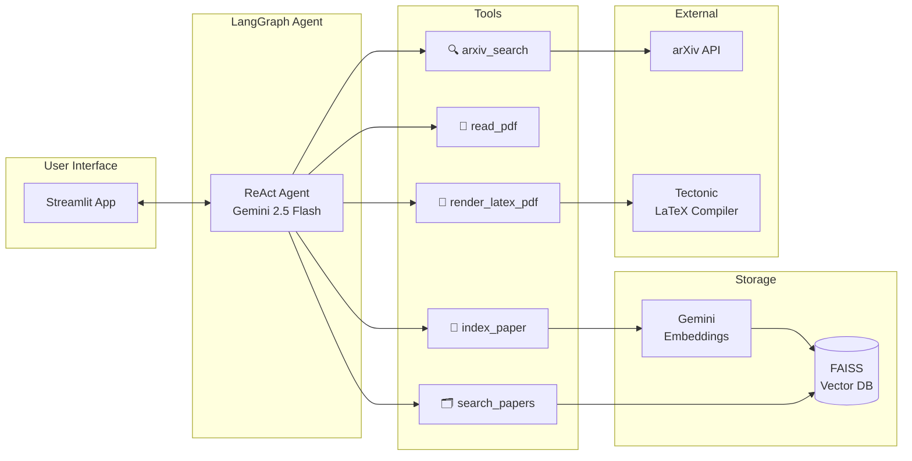
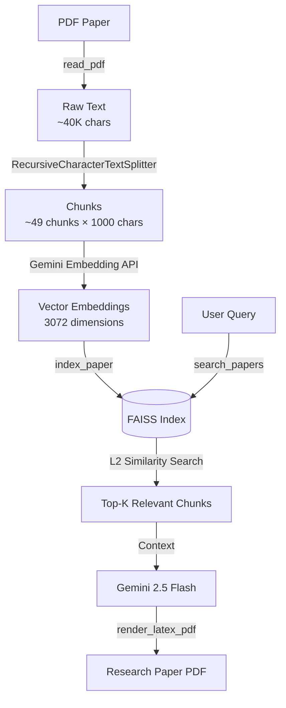

# 🔬 AI Research Assistant — RAG-Powered Paper Discovery, Analysis & Generation

An intelligent research assistant that **searches**, **analyzes**, and **writes** academic papers using a Retrieval-Augmented Generation (RAG) pipeline. Built with LangGraph, FAISS vector database, and Google Gemini.

> This system implements a full research workflow — from paper discovery on arXiv through vector-indexed analysis to LaTeX paper generation with real citations.

---

## Architecture



### RAG Pipeline Flow



---

## Key Features

🔍 **Paper Discovery** — Search arXiv for recent papers across physics, mathematics, computer science, biology, finance, and more

📄 **PDF Ingestion & Chunking** — Extract text from arXiv PDFs, split into semantically meaningful chunks using recursive character splitting

💾 **Vector Indexing** — Embed chunks using Google's Gemini Embedding API and store in FAISS for efficient similarity search

🗂️ **RAG Retrieval** — Retrieve relevant passages from indexed papers using L2 distance-based semantic search instead of stuffing entire papers into context

📝 **Paper Generation** — Write complete academic papers with mathematical equations, compiled to PDF via Tectonic LaTeX engine

📊 **Evaluation Framework** — Measure retrieval quality, faithfulness grounding, and tool reliability with exportable JSON metrics

---

## Evaluation Results

Evaluated using the "Attention Is All You Need" paper (Vaswani et al., 2017):

| Metric | Value |
|--------|-------|
| Chunks Generated | 49 (avg 957 chars each) |
| Retrieval Relevance (L2) | 0.474 best, 0.50 avg |
| Retrieval Hit Rate | 100% across all test queries |
| Faithfulness Grounding | 48% technical term overlap |
| Queries Tested | attention mechanism, transformer architecture, self-attention |

> **Note on Faithfulness:** The 48% score uses keyword-overlap analysis — a deliberately simple, transparent approach. Production systems would use NLI models or LLM-as-judge for semantic evaluation. The keyword method ensures no inflated metrics while still demonstrating grounding in source material.

<details>
<summary>📋 Full Evaluation JSON</summary>

```json
{
  "session_duration_seconds": 12.3,
  "papers_indexed": 1,
  "total_chunks_stored": 49,
  "tool_performance": {},
  "retrieval_metrics": {
    "total_queries": 3,
    "avg_relevance_score": 0.5,
    "hit_rate_percent": 100.0
  }
}
```

</details>

---

## Tech Stack

| Component | Technology | Why This Choice |
|-----------|-----------|-----------------|
| **Agent Framework** | LangGraph (LangChain) | ReAct loop with tool calling, state management, checkpointing |
| **LLM** | Google Gemini 2.5 Flash | 1M context window, free tier, strong tool calling |
| **Embeddings** | Google Gemini Embedding API | Free, 3072-dim vectors, multilingual support |
| **Vector Database** | FAISS (local) | No external service needed, zero-config, fast L2 search |
| **Text Splitting** | RecursiveCharacterTextSplitter | Preserves semantic boundaries across paragraphs and sentences |
| **Paper Source** | arXiv API (Atom/XML) | Free, structured metadata, covers all major research fields |
| **PDF Rendering** | Tectonic (LaTeX) | Lightweight, single-binary LaTeX compiler with auto-dependency fetching |
| **Frontend** | Streamlit | Rapid prototyping with real-time streaming and session state |
| **Package Manager** | uv | Modern Python tooling — fast, deterministic dependency resolution |

---

## How It Works

### 1. Search Phase
```
User: "I'm interested in attention mechanisms"
→ Agent immediately calls arxiv_search("attention mechanisms")
→ Returns 5 recent papers with titles, authors, summaries, PDF links
```

### 2. Analysis Phase
```
User: "Read the Transformer paper"
→ read_pdf(url) extracts ~40K chars of text
→ index_paper(title) chunks it into ~49 pieces, embeds via Gemini, stores in FAISS
→ Agent provides detailed analysis: problem, methodology, results, limitations
```

### 3. Writing Phase (RAG in Action)
```
User: "Write a paper about improvements to self-attention"
→ search_papers("self-attention improvements") queries FAISS
→ Returns top-5 relevant chunks (not the entire paper!)
→ Agent writes LaTeX using retrieved context
→ render_latex_pdf(latex) compiles to PDF via Tectonic
```

**Why RAG matters here:** Instead of stuffing a 40K-character paper into the LLM's context (which would exceed token limits), we store it in FAISS and retrieve only the ~5K chars that are relevant to the current task. This is scalable — index 10 papers and still stay within token limits.

---

## Project Structure

```
research-agent/
├── src/
│   ├── config.py              # LLM, embedding, and app configuration
│   ├── evaluation.py          # Retrieval, faithfulness, and coverage metrics
│   ├── graph.py               # LangGraph ReAct agent orchestration
│   ├── app.py                 # Streamlit UI with streaming + tool status
│   └── tools/
│       ├── arxiv_tool.py      # arXiv API search with XML parsing
│       ├── read_pdf.py        # PDF text extraction with internal caching
│       ├── vector_store.py    # FAISS index + Gemini embeddings + search
│       └── write_pdf.py       # LaTeX sanitization + Tectonic compilation
├── test_eval.py               # Standalone evaluation script
├── output/                    # Generated .tex, .pdf, and metrics JSON
├── pyproject.toml
├── .env.example
└── README.md
```

---

## Setup

### Prerequisites
- Python 3.10+
- [uv](https://docs.astral.sh/uv/) package manager
- [Tectonic](https://tectonic-typesetting.github.io/) LaTeX compiler
- Free [Google AI Studio API key](https://aistudio.google.com/apikey)

### Installation

```bash
# Clone the repo
git clone https://github.com/YOUR_USERNAME/ai-research-assistant.git
cd ai-research-assistant

# Install dependencies
uv sync

# Configure environment
cp .env.example .env
# Add your GOOGLE_API_KEY to .env
```

### Run the App

```bash
uv run streamlit run src/app.py
```

### Run Evaluation

```bash
uv run python test_eval.py
# Results saved to output/evaluation_results.json
```

---

## Design Decisions

| Decision | Reasoning |
|----------|-----------|
| **Single ReAct agent over multi-agent** | Evaluated both architectures. Multi-agent added routing overhead and extra LLM calls without improving output quality. Single agent with 5 specialized tools achieves the same functionality with lower latency and simpler debugging. |
| **FAISS over Pinecone/Weaviate** | Runs locally with zero external dependencies. Anyone can clone and run immediately — no accounts, no API keys for the vector DB. |
| **Gemini Embeddings over local models** | Avoided PyTorch/ONNX dependency issues on Windows. Gemini embedding API is free, produces high-quality 3072-dim vectors, and requires zero native libraries. |
| **Keyword-overlap faithfulness over LLM-as-judge** | Deliberately chose a simple, transparent metric that doesn't inflate scores. Production would use NLI models, but keyword overlap is reproducible and honest. |
| **Internal text caching in read_pdf** | Full paper text stored in `_last_read` dict so `index_paper` can access it without passing 40K chars through the LLM's context window. |
| **LaTeX sanitization pipeline** | LLMs generate broken LaTeX (unicode, missing packages, markdown fences). Built a robust sanitizer handling 20+ failure modes. |

---

## Limitations & Future Work
- arXiv API uses keyword matching, not semantic search — some results 
  may not be perfectly relevant. In production, Semantic Scholar API 
  would provide better relevance ranking.
- **Embedding scope:** Vector store is in-memory — resets each session. Could persist with `faiss.write_index()` for cross-session usage.
- **Faithfulness evaluation:** Current keyword-overlap approach is simple by design. Integration with an NLI model (e.g., cross-encoder) would provide semantic faithfulness scoring.
- **Single paper depth:** Currently optimized for indexing 1-3 papers per session. Batch ingestion pipeline would improve multi-paper research workflows.
- **Reference verification:** The LLM may supplement references from its training knowledge. A citation verification tool that validates arXiv IDs could ensure 100% real citations.

---
